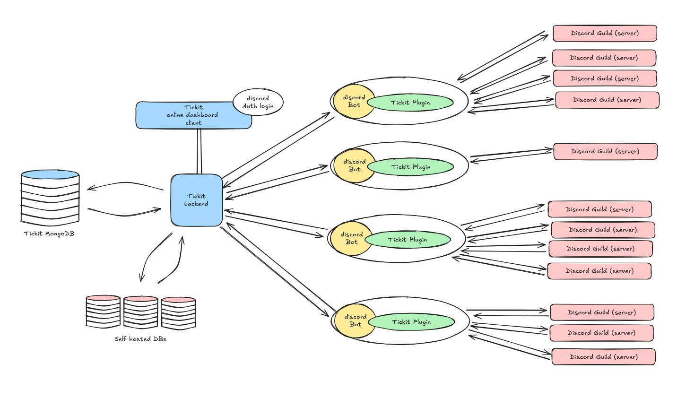

# Tickit Backend

Tickit Backend is a brand new project designed to be the core backend for a powerful, scalable Discord ticketing system.
This application will serve as the engine for ticket plugins that developers can seamlessly integrate into their Discord
bots using [https://robojs.dev/](https://robojs.dev/).



As illustrated in the diagram, Tickit Backend acts as the central hub, managing data in MongoDB and optionally
self-hosted databases. It communicates with multiple Discord bots, each equipped with the Tickit Plugin. These bots then
interact with numerous Discord Guilds (servers), enabling efficient ticket management across a wide range of
communities.

This architecture allows for:

* **Scalability:** Handling a large number of guilds and tickets efficiently.
* **Flexibility:** Developers can customize the Tickit Plugin to suit their specific bot's functionality.
* **Centralized Management:** Administrators can monitor and manage the ticketing system through the Tickit Backend
  dashboard.

**Key Changes and Why:**

* **"Brand New Project":** Emphasizes that it's a fresh endeavor.
* **Focus on Robo.js:** Highlights the integration with Robo.js for plugin development.
* **Image Integration:** Explicitly refers to the image and explains its components.
* **Benefits Highlighted:** Clearly states the advantages of the architecture.
* **Clearer Language:** Uses more accessible terms like "engine" and "central hub."

---

## Planned Enhancements

### Core Features

- [ ] **Ticket Management:**
    - [ ] Add endpoints for creating, updating, and deleting tickets.
    - [ ] Implement ticket assignment to staff members.
    - [ ] Add ticket priority levels (e.g., low, medium, high).

- [ ] **Guild Management:**
    - [ ] Add endpoints for managing guild configurations (e.g., ticket categories, roles).
    - [ ] Implement guild-specific settings for ticketing.

- [ ] **User Authentication:**
    - [ ] Add JWT-based authentication for admins and staff.
    - [ ] Implement role-based access control (RBAC).

### Dashboard Enhancements

- [ ] **Ticket Dashboard:**
    - [ ] Add a page to view and manage tickets.
    - [ ] Include filters for ticket status, priority, and assigned staff.

- [ ] **Analytics:**
    - [ ] Add a dashboard for viewing ticket statistics (e.g., total tickets, resolved tickets).
    - [ ] Include charts for ticket trends over time.

- [ ] **Error Logs:**
    - [ ] Add a page to view and search error logs.

### System Enhancements

- [ ] **Database Sharding:**
    - [ ] Implement MongoDB sharding for better scalability.

- [ ] **Queue System:**
    - [ ] Add a job queue (e.g., Bull.js) for handling background tasks like ticket notifications.

- [ ] **Rate Limiting:**
    - [ ] Implement rate limiting for API endpoints to prevent abuse.

- [ ] **Webhooks:**
    - [ ] Add webhook support for external integrations (e.g., Discord notifications).

### Security

- [ ] **Encryption:**
    - [ ] Encrypt sensitive data stored in the database.
    - [ ] Use HTTPS for all API requests.

- [ ] **Audit Logs:**
    - [ ] Add audit logs for tracking changes to tickets and configurations.

### Testing

- [ ] **Unit Tests:**
    - [ ] Add unit tests for all API endpoints and utility functions.

- [ ] **Integration Tests:**
    - [ ] Add integration tests for database operations and API workflows.

- [ ] **Load Testing:**
    - [ ] Test the system under high traffic to ensure scalability.

---

## Features

- **Health Monitoring**:
    - API endpoint (`/api/health`) to check the status of the system, including database connection, memory usage, and
      uptime.
    - Dashboard page (`/dashboard/health`) to visually monitor the system's health.

- **Database Management**:
    - MongoDB connection with support for multiple guild-specific databases.
    - Automatic reconnection logic for disconnected databases.

- **Ticket Management**:
    - Guild-specific ticket models for managing tickets in Discord servers.
    - Modular design for adding more models and features in the future.

- **Scalable Architecture**:
    - Uses `mongoose` for MongoDB connections.
    - Supports in-memory MongoDB for testing with `mongodb-memory-server`.

- **Modern UI**:
    - Built with **Tailwind CSS** for a clean and responsive design.

---

## Installation

### Prerequisites

- **Node.js**: v18 or higher
- **MongoDB**: A running MongoDB instance (local or cloud)
- **npm**: Installed with Node.js

### Steps

1. Clone the repository:

```bash
  git clone https://github.com/your-username/tickit-backend.git
  cd tickit-backend
```

2. Install dependencies:

```bash
  npm install
```

---

## Create a `.env.local` file in the root directory and configure the following environment variables:

### MongoDB Configuration

- **MONGODB_URI**: The connection string for your MongoDB database. This should point to a running MongoDB instance,
  either locally or in the cloud.

```dotenv
MONGODB_URI=mongodb://localhost:27017/tickit
```

### JWT Configuration

- **JWT_SECRET**: A secure secret key used for signing JSON Web Tokens (JWTs). This key should be long, random, and kept
  confidential.

```dotenv
JWT_SECRET=your-secure-jwt-secret-key
```

- **JWT_EXPIRY**:  The expiration time for JWT tokens. It defines how long a token remains valid (e.g., '7d' for seven
  days, '24h' for 24 hours).

```dotenv
JWT_EXPIRY=7d
```

### Encryption Keys

- **ENCRYPTION_KEY**: A 32-character encryption key used for securing sensitive data. This must be exactly 32 characters
  long.

```dotenv
ENCRYPTION_KEY=32-character-encryption-key
```

- **ENCRYPTION_IV**: A 16-character initialization vector (IV) used in encryption algorithms for added security. This
  must be exactly 16 characters long.

```dotenv
ENCRYPTION_IV=16-character-iv
```

### Environment

- **NODE_ENV**: Specifies the application environment mode. Common values include:
    * `development` (for local development)
    * `production` (for live deployment)
    * `test` (for testing environments)

```dotenv
NODE_ENV=development
```

---

## Run the development server:

```bash
  npm run dev
```

## Project Structure

```text
tickit-backend/
├── src/
│   ├── app/
│   │   ├── api/
│   │   │   ├── health/
│   │   │   │   └── route.js       # Health API endpoint
│   │   │   ├── reconnect/
│   │   │   │   └── route.js       # Reconnect API endpoint
│   │   ├── dashboard/
│   │   │   ├── health/
│   │   │   │   └── page.js        # Health dashboard page
│   ├── lib/
│   │   ├── mongodb/
│   │   │   └── connection.js      # MongoDB connection logic
│   │   ├── utils/
│   │   │   └── logger.js          # Logger utility
├── .env.local                     # Environment variables
├── next.config.mjs                # Next.js configuration
├── tailwind.config.js             # Tailwind CSS configuration
├── postcss.config.js              # PostCSS configuration
└── README.md                      # Project documentation
```

## Contributing

### Contributions are welcome! If you’d like to contribute, please follow these steps:

    Fork the repository.
    Create a new branch for your feature or bug fix.
    Commit your changes and push them to your fork.
    Submit a pull request with a detailed description of your changes.

## License

This project is licensed under the MIT License. See the LICENSE file for details.
Contact

### For questions or support, please contact:

    Email: ivo.urbanski@gmail.com
    GitHub Issues: https://github.com/frogalo/tickit-backend/issues
